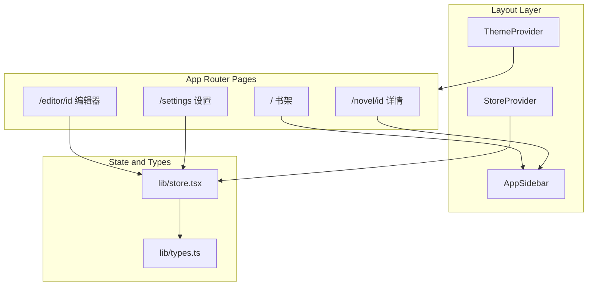

# 神笔马良

AI 辅助网文创作工作台，支持章节/幕结构写作、世界观词条管理与多模型配置。

> 当前版本：**v0.3.0-alpha** · 开源协议：**AGPL v3** · 仓库：[github.com/hellopan/ShenBiMaLiang](https://github.com/hellopan/ShenBiMaLiang)

---

## 目录

- [项目简介](#项目简介)
- [技术栈](#技术栈)
- [快速开始](#快速开始)
- [仓库目录结构](#仓库目录结构)
- [路由与页面](#路由与页面)
- [组件与模块](#组件与模块)
- [功能说明](#功能说明)
- [前端架构](#前端架构)
- [数据模型](#数据模型)
- [主题系统](#主题系统)
- [后续规划](#后续规划)
- [开发与贡献](#开发与贡献)

---

## 项目简介

**神笔马良** 是一款面向网文创作者的工具，围绕「章节 → 幕」的分层写作流程设计，提供 AI 提示词配置、世界观词条注入、多模型接入等能力。

当前仓库以 **Next.js 前端原型** 为主，数据保存在 React Context 内存中（刷新后重置为 seed 数据），尚未接入真实 LLM API 与后端持久化。

---

## 技术栈

| 类别 | 选型 |
|------|------|
| 框架 | Next.js 16（App Router）+ React 19 |
| 语言 | TypeScript |
| 样式 | Tailwind CSS v4 + `frontend/app/globals.css` |
| UI | shadcn/ui（Base UI）+ Lucide 图标 |
| 主题 | next-themes（glass / light / dark） |
| 状态 | React Context — `frontend/lib/store.tsx`（内存 seed 数据） |
| 包管理 | pnpm |

---

## 快速开始

```bash
cd frontend
pnpm install
pnpm dev      # 默认 http://localhost:3000
pnpm build
pnpm start
pnpm lint
```

---

## 仓库目录结构

```
ShenBiMaLiang/
├── frontend/                 # Next.js 前端（当前主要代码）
│   ├── app/                  # App Router 页面与全局样式
│   ├── components/           # 业务组件 + ui/
│   ├── lib/                  # store、types、utils
│   ├── public/               # 静态资源
│   ├── package.json
│   └── components.json       # shadcn 配置
└── docs/
    └── 架构设计v1.md          # 后端/全栈规划（尚未实现）
```

### `frontend/app/` 页面文件

```
app/
├── layout.tsx              # 根布局：ThemeProvider、StoreProvider、渐变背景
├── globals.css             # 全局样式与三主题 CSS 变量
├── page.tsx                # 首页 · 我的书架
├── about/page.tsx          # 关于 · 版本与更新日志
├── settings/page.tsx       # 设置 · 模型配置与主题
├── inspiration/page.tsx    # 灵感片段（占位）
├── stats/page.tsx          # 统计分析（占位）
├── logs/page.tsx           # 请求日志（占位）
├── encyclopedia/page.tsx   # 世界观词条（独立页）
├── novel/[id]/page.tsx     # 小说详情（多 Section 单页应用）
└── editor/[id]/page.tsx    # 章节幕编辑器
```

---

## 路由与页面

| 路由 | 文件 | 状态 |
|------|------|------|
| `/` | `app/page.tsx` | ✅ 书架、搜索、新建/删除小说 |
| `/novel/[id]` | `app/novel/[id]/page.tsx` | ✅ 多 Tab 详情（总览/基本信息/写作配置/大纲/章节/词条/导出等） |
| `/editor/[id]` | `app/editor/[id]/page.tsx` | ✅ 章节幕编辑器 + AI 提示词面板 |
| `/settings` | `app/settings/page.tsx` | ✅ 模型配置、主题切换 |
| `/encyclopedia` | `app/encyclopedia/page.tsx` | ✅ 独立词条管理页 |
| `/inspiration` | `app/inspiration/page.tsx` | 🔜 占位：即将推出 |
| `/stats` | `app/stats/page.tsx` | 🔜 占位：即将推出 |
| `/logs` | `app/logs/page.tsx` | 🔜 占位：即将推出 |
| `/about` | `app/about/page.tsx` | ✅ 版本与更新日志 |

---

## 组件与模块

### `frontend/components/`

```
components/
├── layout/
│   └── app-sidebar.tsx       # 全局侧栏（home / novel 两种模式）
├── editor/
│   ├── chapter-sidebar.tsx   # 编辑器左侧章节/幕导航
│   ├── chapter-editor.tsx    # 幕大纲与正文编辑
│   └── ai-prompts-panel.tsx  # 右侧 AI 规则/参数/模型配置
├── encyclopedia/
│   └── encyclopedia-panel.tsx
├── ui/                       # shadcn 基础组件
│   ├── button.tsx
│   ├── card.tsx
│   ├── dialog.tsx
│   ├── input.tsx
│   └── …（共 19 个）
├── new-novel-dialog.tsx      # 新建小说对话框
├── model-dialog.tsx          # 模型配置对话框
├── entry-dialog.tsx          # 词条编辑对话框
├── novel-card.tsx            # 小说卡片（备用，首页当前用内联 NovelCard）
├── page-header.tsx
├── app-logo.tsx
└── theme-provider.tsx        # next-themes 封装
```

### `frontend/lib/`

| 文件 | 职责 |
|------|------|
| `types.ts` | 核心类型：`Novel` / `Chapter` / `Act` / `ModelConfig` / `Entry` 等 |
| `store.tsx` | 全局状态（React Context）与 seed 演示数据 |
| `utils.ts` | `cn()` 等通用工具函数 |

---

## 功能说明

### ✅ 已实现

#### 书架（`/`）

- 小说卡片展示（类型渐变封面、字数、更新时间）
- 悬停操作：打开详情、删除（警示红色样式）
- 搜索书名/类型、筛选「全部 / 最近更新」
- 新建小说对话框

#### 小说详情（`/novel/[id]`）

单页多 Section，侧栏切换（`AppSidebar mode="novel"`）：

| Section | 说明 |
|---------|------|
| 总览 | 封面、统计、写作进度、跳转编辑器/大纲 |
| 基本信息 | 标题、类型、简介、目标字数等 |
| 写作配置 | 文风/禁忌提示词、大纲/正文生成参数 |
| 大纲生成 | 章节数/幕数配置、模拟生成流程（UI） |
| 章节概览 | 章节列表与字数统计 |
| 世界词条 | CRUD、分类、关键词/正则、权重 |
| 导出 | 导出相关 UI |

#### 编辑器（`/editor/[id]`）

- 三栏布局：章节/幕侧栏 · 幕编辑器 · AI 提示词面板
- 章节/幕树：新增章节、展开折叠、切换幕
- 幕编辑：大纲与正文、字数统计
- 按幕 AI 配置：模型选择、temperature/topP/topK、规则开关、自定义提示词规则

#### 设置（`/settings`）

- 多 Provider 模型接入：OpenAI / Anthropic / DeepSeek / Custom
- 模型 CRUD、启用/禁用
- 主题切换：毛玻璃 / 浅色 / 深色

#### 其他

- **世界观词条**（`/encyclopedia` 及小说详情内嵌）：词条管理与关键词关联
- **关于**（`/about`）：更新日志与版本信息

### 🔜 占位 / 规划中

| 功能 | 说明 |
|------|------|
| 灵感片段 | 页面已建，标注「即将推出」 |
| 统计分析 | 写作字数趋势、Token 用量 |
| 请求日志 | AI 接口调用记录 |
| 时间线 / 人物状态 / 人物关系图 | 小说详情 Section 占位 |
| 真实 LLM 调用 | 当前为前端 mock，无 API 请求 |
| 数据持久化 | 刷新后恢复 seed 数据 |
| 后端服务 | FastAPI + SQLite，见 `docs/架构设计v1.md` |

---

## 前端架构



**数据流概要：**

1. `app/layout.tsx` 挂载 `ThemeProvider` → `StoreProvider` → `TooltipProvider`
2. 各页面通过 `useStore()` 读写小说、模型、词条
3. 编辑器按幕维护独立的 `ActAIConfig`（模型与生成参数）
4. 侧栏 `AppSidebar` 在 home / novel 两种模式间切换导航

---

## 数据模型

核心类型定义于 `frontend/lib/types.ts`：

```
Novel
├── id, title, genre, synopsis
├── chapters: Chapter[]
│   ├── title, outline
│   ├── acts: Act[]              # 幕：outline + content
│   ├── stylePrompt / forbidPrompt
│   ├── customRules: PromptRule[]
│   └── genParams
├── outlineConfig / contentConfig  # 大纲/正文生成参数
├── stylePrompt / forbiddenPrompt
└── targetWordCount, writingLanguage

ModelConfig                       # 多模型 API 配置
├── provider, modelName, apiKey
└── baseUrl, maxTokens, active

Entry                            # 世界观词条
├── category, content
├── keywords, regexPatterns
├── weight, active
└── novelId（可选关联）
```

**字数统计：** `wordCount()` 支持中英文混合计数，聚合至章节/小说总量。

---

## 主题系统

三套主题通过 `next-themes` 管理，在 **设置 → 主题外观** 切换，选择持久化至 localStorage。

| 主题 | 说明 |
|------|------|
| `glass`（默认） | 毛玻璃暗色风格，渐变背景 + 装饰光斑 |
| `light` | 浅色实色界面 |
| `dark` | 深色实色界面 |

相关文件：

- `frontend/app/layout.tsx` — `ThemeProvider` 配置（`defaultTheme="glass"`）
- `frontend/app/globals.css` — 各主题 CSS 变量与 glass 特效
- `frontend/app/settings/page.tsx` — 主题切换 UI

---

## 后续规划

完整架构设计见 [`docs/架构设计v1.md`](docs/架构设计v1.md)，规划内容包括：

- FastAPI 后端 + SQLite 持久化
- LLM 流式输出与 Prompt 编排
- 关键词/正则触发的词条自动注入
- Chroma 向量检索（按需）

> **说明：** 架构文档中前端技术栈写为 React + Vite，当前仓库已演进为 **Next.js App Router**；后端代码尚未入库。

---

## 开发与贡献

- **主开发分支：** `dev`
- **代码风格：** 遵循现有 shadcn/ui + Tailwind 约定，组件放 `components/`，页面放 `app/`
- **路径别名：** `@/components`、`@/lib`（见 `frontend/components.json`）

欢迎提交 Issue 与 Pull Request。
